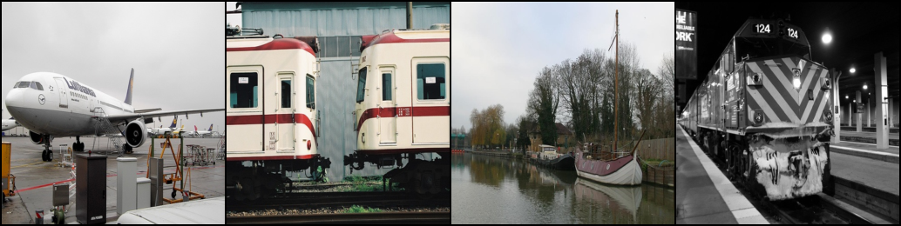

# 🚀 End-to-End Image Segmentation with U-Net in PyTorch

## 📝 Project Overview
This project is a complete, end-to-end implementation of the U-Net architecture for semantic image segmentation using the PyTorch framework. The model is trained on the PASCAL VOC 2012 dataset to identify and outline various objects. The entire pipeline, from data acquisition and preprocessing to model training, evaluation, and visualization, is built from scratch in a Google Colab environment.

## ✨ Key Features
* **End-to-End Pipeline:** Complete workflow from data loading to training and evaluation.
* **U-Net from Scratch:** Implementation of the U-Net architecture, including the Encoder, Decoder, and Skip Connections.
* **Efficient Data Handling:** Custom PyTorch `Dataset` and `DataLoader` for robust and parallelized data preprocessing.
* **Comprehensive Evaluation:** Performance measured using both Pixel Accuracy and the more robust Dice Score.
* **Result Visualization:** A dedicated function to save and compare original images, ground truth masks, and model predictions.

## 🛠️ Tech Stack
* **Language:** Python
* **Core Libraries:** PyTorch, Torchvision
* **Tools:** tqdm (for progress bars), Pillow (for image processing)
* **Platform:** Google Colab, Kaggle API

## ⚙️ How to Run
1.  **Clone the Repository:**
    ```bash
    gh repo clone vp763/PyTorch-UNET-Image-Segmentation
    ```
2.  **Install Dependencies:**
    ```bash
    pip install -r requirements.txt
    ```
3.  **Set up Kaggle API:** Place your `kaggle.json` API key in the appropriate directory as per the notebook's instructions. (Or use the Google Drive method).
4.  **Execute the Notebook:** Open the `IMAGE_SEGMENTATION.ipynb` file in Google Colab or Jupyter and run the cells sequentially.

## 📊 Results & Visualization
After training for 25 epochs, the model achieved the following performance on the validation set:

* **Pixel Accuracy:** 66.42%
* **Dice Score:** 0.2984

### Prediction Examples
Here is a sample of the model's predictions on the validation data.

**Original Images:**


**True Masks (Ground Truth):**


**Predicted Masks by our U-Net:**

